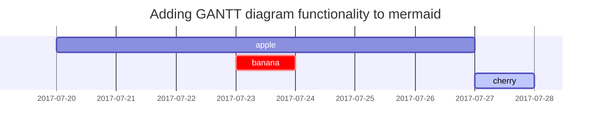

WebRTC หรือ Web Real Time Communication...

## Introduce

เป็นเทคโนโลยีที่ work บนเว็บเบราเซอร์สมัยใหม่ รวมถึงเป็น open source ด้วย!!🤩

WebRTC สามารถส่งข้อมูลประเภท `Media` (Video, Audio), `Text` ได้ผ่านทาง `Data Channels` ด้วย `Peer(P2P)` communication 

Note: *`Data Channels` ก็มีให้เลือกว่าจะส่งแบบ `Media` หรือ `Text`*

## Diagram ปูพื้นฐาน P2P

```mermaid
flowchart LR
  Device1 --> Signaling Server
```



